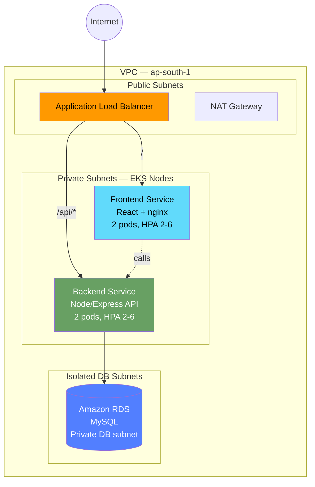
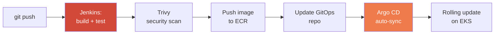

<div align="center">

# 🛒 Production-Ready Three-Tier E-Commerce Platform on AWS EKS

**Infrastructure as Code · Container Orchestration · GitOps CI/CD · Cloud-Native Monitoring**


</div>

---

## Overview

A demo e-commerce platform built to show a complete, production-style DevOps workflow
end to end — from infrastructure provisioning to a live, auto-scaling application with
automated deployments.

**Stack:** AWS · Terraform · Kubernetes (EKS) · Docker · Jenkins · Argo CD · Amazon ECR · RDS · ALB · CloudWatch

## Architecture



**CI/CD pipeline:**



**Observability:** CloudWatch log groups, Container Insights, CPU utilization alarms.

## Repo layout

| Path | Contents |
|---|---|
| `terraform/` | VPC, EKS cluster + node group, IAM (incl. IRSA for the ALB controller), RDS MySQL, ECR repos, CloudWatch log groups/alarms |
| `app/frontend/` | React storefront — product listing, place order |
| `app/backend/` | Node/Express REST API — products, orders, MySQL connection pool |
| `app/db/` | `schema.sql` — tables + seed data |
| `docker/` | Multi-stage Dockerfiles for both services |
| `k8s/` | Namespace, ConfigMap, Secret template, Deployments, Services, HPA, ALB Ingress (path-based routing) |
| `ci-cd/` | Jenkinsfile (build → scan → push → update GitOps) + Argo CD `Application` manifest |
| `docs/` | `DEPLOYMENT.md` — full step-by-step setup guide |

## What this demonstrates

- 🏗️ **Infrastructure as Code** — entire AWS footprint (20+ resources: VPC, subnets, NAT, EKS, IAM/IRSA, ECR, RDS, CloudWatch) is Terraform-managed and reproducible from scratch.
- 📦 **Container orchestration** — Deployments, Services, ConfigMaps/Secrets, HPA, and rolling updates on EKS for zero-downtime releases.
- 🔁 **CI/CD + GitOps** — Jenkins builds and security-scans images (Trivy), pushes to ECR, and updates a GitOps repo that Argo CD continuously syncs to the cluster.
- 📊 **Monitoring** — CloudWatch Container Insights, log groups, and CPU alarms for infrastructure visibility.

## 🔧 Troubleshooting Log

## 🔧 Troubleshooting Log

These are real issues hit while deploying this to a live AWS account — kept here mostly unedited because the debugging process is more useful than a sanitized summary.

### ALB never got an address

`kubectl get ingress` sat with an empty `ADDRESS` column for 45+ minutes. Checked the Load Balancer Controller logs:

```
error: "couldn't auto-discover subnets: failed to list subnets by reachability: operation error EC2: DescribeRouteTables,
https response error StatusCode: 403 ... UnauthorizedOperation: You are not authorized to perform this operation.
User: arn:aws:sts::...:assumed-role/ecommerce-eks-alb-controller-role/... is not authorized to perform: ec2:DescribeRouteTables"
```

The controller's IAM role (created via IRSA) was missing a permission it needed just to *look at* the VPC's route tables. Attached `AmazonEC2ReadOnlyAccess` to the role and re-triggered a reconcile. That error went away — but a new one showed up immediately after.

### Then: `InvalidParameterValue: vpc-id`

```
error: "operation error EC2: DescribeSecurityGroups ... api error InvalidParameterValue: vpc-id"
```

Took a while to spot this one. Compared what the controller was actually using against the real VPC:

```
kubectl get deployment aws-load-balancer-controller -n kube-system -o yaml | grep -A2 "vpc-id"
--aws-vpc-id=046f7a34eab8e3d74

aws ec2 describe-vpcs --query "Vpcs[0].VpcId" --output text
vpc-046f7a34eab8e3d74
```

Missing the `vpc-` prefix — a copy-paste error from when the Helm install command was first run. AWS silently rejects a VPC ID in that shape instead of raising a "not found" error, which is why it looked like a permissions issue at first, not a formatting one. Patched the deployment's args with the correct ID and restarted it.

### Ingress stuck "currently being deleted"

After a botched delete/recreate cycle (mid-debugging, terminal connection dropped), the Ingress got stuck:

```
Warning: Detected changes to resource ecommerce-ingress which is currently being deleted.
```

`kubectl get ingress -n ecommerce -o yaml | grep -A5 finalizers` showed a lingering `ingress.k8s.aws/resources` finalizer — the controller's own cleanup hook, which couldn't complete because of the earlier permission error, so Kubernetes was stuck waiting on it forever. Removed it directly:

```
kubectl patch ingress ecommerce-ingress -n ecommerce --type=json -p='[{"op": "remove", "path": "/metadata/finalizers"}]'
```

Then reapplied clean.

### `terraform destroy` wouldn't finish

Ran into this near the end:

```
Error: ECR Repository (ecommerce-eks-backend) not empty, consider using force_delete
Error: deleting EC2 Internet Gateway: DependencyViolation: Network vpc-xxx has some mapped public address(es)
Error: deleting EC2 Subnet: DependencyViolation: The subnet has dependencies and cannot be deleted
```

Terraform doesn't force-delete ECR repos with images still in them, and it has no idea about resources the AWS Load Balancer Controller created on its own (the ALB itself, plus two security groups it provisioned dynamically). Had to clear these manually before Terraform could finish:

```
aws ecr delete-repository --repository-name ecommerce-eks-backend --force
aws elbv2 delete-load-balancer --load-balancer-arn arn:aws:elasticloadbalancing:...
aws ec2 delete-security-group --group-id sg-05999091ba58055b7
aws ec2 delete-security-group --group-id sg-0980136dd351d09a3
```

Once those were gone, `terraform destroy` completed cleanly on the retry.

### Post-destroy audit

`terraform destroy` finishing doesn't automatically mean the bill stops — anything the Load Balancer Controller or manual `aws` commands created outside Terraform's state isn't tracked, so it isn't touched by `destroy` either. Ran a manual sweep afterward and found a leftover NAT Gateway and two unattached Elastic IPs still sitting there:

```
aws ec2 describe-nat-gateways --filter "Name=state,Values=available" --query "NatGateways[*].NatGatewayId" --output text
nat-14f8c44ce26a1e176

aws ec2 describe-addresses --query "Addresses[*].[AllocationId,AssociationId]" --output table
eipalloc-01754f0ffcea0d56e   None
eipalloc-07162ec5539d6d206   None
```

Deleted the NAT Gateway and released both IPs manually, then re-ran the same checks until every query came back empty.

---

**What this actually reinforced:** Terraform's state file is the source of truth for *what Terraform created* — not for what exists in your AWS account. Anything a controller, add-on, or manual `aws` command creates on the side (load balancers, security groups, NAT gateways left behind mid-debug) needs its own manual audit before you can trust that "destroy" really means the billing has stopped.


## Getting started

See [`docs/DEPLOYMENT.md`](docs/DEPLOYMENT.md) for the full step-by-step guide —
Terraform apply → kubectl config → ALB controller → build/push images → deploy → wire up
Jenkins/Argo CD.

## Live Demo


## Local development (without AWS)

```bash
# backend
cd app/backend && npm install
DB_HOST=localhost DB_USER=root DB_PASSWORD=pass DB_NAME=ecommerce npm run dev

# frontend
cd app/frontend && npm install && npm start
```

Point a local MySQL instance at `app/db/schema.sql` to seed sample data.

## Cost note

Running this live on AWS costs a few dollars/day (EKS control plane, EC2 nodes, NAT
gateway, RDS). Run `terraform destroy` when you're done with a demo session.

---

<div align="center">
Built by <a href="https://github.com/Afeeza-sadiq">Afeeza Sadiq</a>
</div>
