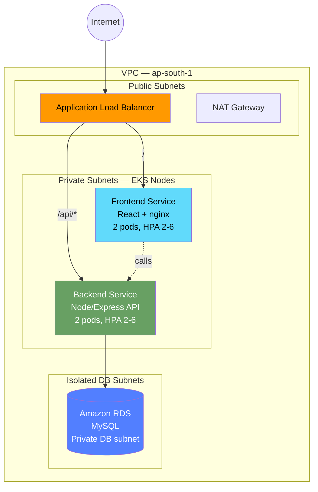
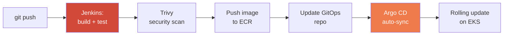

<div align="center">

# 🛒 Production-Ready Three-Tier E-Commerce Platform on AWS EKS

**Infrastructure as Code · Container Orchestration · GitOps CI/CD · Cloud-Native Monitoring**


</div>

---

## Overview

A demo e-commerce platform built to show a complete, production-style DevOps workflow
end to end — from infrastructure provisioning to a live, auto-scaling application with
automated deployments.

**Stack:** AWS · Terraform · Kubernetes (EKS) · Docker · Jenkins · Argo CD · Amazon ECR · RDS · ALB · CloudWatch

## Architecture



**CI/CD pipeline:**



**Observability:** CloudWatch log groups, Container Insights, CPU utilization alarms.

## Repo layout

| Path | Contents |
|---|---|
| `terraform/` | VPC, EKS cluster + node group, IAM (incl. IRSA for the ALB controller), RDS MySQL, ECR repos, CloudWatch log groups/alarms |
| `app/frontend/` | React storefront — product listing, place order |
| `app/backend/` | Node/Express REST API — products, orders, MySQL connection pool |
| `app/db/` | `schema.sql` — tables + seed data |
| `docker/` | Multi-stage Dockerfiles for both services |
| `k8s/` | Namespace, ConfigMap, Secret template, Deployments, Services, HPA, ALB Ingress (path-based routing) |
| `ci-cd/` | Jenkinsfile (build → scan → push → update GitOps) + Argo CD `Application` manifest |
| `docs/` | `DEPLOYMENT.md` — full step-by-step setup guide |

## What this demonstrates

- 🏗️ **Infrastructure as Code** — entire AWS footprint (20+ resources: VPC, subnets, NAT, EKS, IAM/IRSA, ECR, RDS, CloudWatch) is Terraform-managed and reproducible from scratch.
- 📦 **Container orchestration** — Deployments, Services, ConfigMaps/Secrets, HPA, and rolling updates on EKS for zero-downtime releases.
- 🔁 **CI/CD + GitOps** — Jenkins builds and security-scans images (Trivy), pushes to ECR, and updates a GitOps repo that Argo CD continuously syncs to the cluster.
- 📊 **Monitoring** — CloudWatch Container Insights, log groups, and CPU alarms for infrastructure visibility.

## Getting started

See [`docs/DEPLOYMENT.md`](docs/DEPLOYMENT.md) for the full step-by-step guide —
Terraform apply → kubectl config → ALB controller → build/push images → deploy → wire up
Jenkins/Argo CD.

## Local development (without AWS)

```bash
# backend
cd app/backend && npm install
DB_HOST=localhost DB_USER=root DB_PASSWORD=pass DB_NAME=ecommerce npm run dev

# frontend
cd app/frontend && npm install && npm start
```

Point a local MySQL instance at `app/db/schema.sql` to seed sample data.

## Cost note

Running this live on AWS costs a few dollars/day (EKS control plane, EC2 nodes, NAT
gateway, RDS). Run `terraform destroy` when you're done with a demo session.

---

<div align="center">
Built by <a href="https://github.com/Afeeza-sadiq">Afeeza Sadiq</a>
</div>
